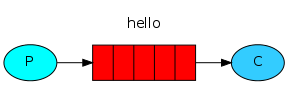

## 01 Hello world

```
java -jar ./target/rabbitmq-1.0.jar --spring.profiles.active=hello-world,receiver

java -jar ./target/rabbitmq-1.0.jar --spring.profiles.active=hello-world,sender
```

## 02 Work Queues

```
java -jar ./target/rabbitmq-1.0.jar --spring.profiles.active=work-queues,receiver

java -jar ./target/rabbitmq-1.0.jar --spring.profiles.active=work-queues,sender
```

## 03 Publish/Subscribe

```
java -jar ./target/rabbitmq-1.0.jar --spring.profiles.active=publish-subscribe,receiver

java -jar ./target/rabbitmq-1.0.jar --spring.profiles.active=publish-subscribe,sender
```

## 04 Routing

```
java -jar ./target/rabbitmq-1.0.jar --spring.profiles.active=routing,receiver

java -jar ./target/rabbitmq-1.0.jar --spring.profiles.active=routing,sender
```

## 05 Topics

```
java -jar ./target/rabbitmq-1.0.jar --spring.profiles.active=topics,receiver

java -jar ./target/rabbitmq-1.0.jar --spring.profiles.active=topics,sender
```

## 06 RPC

```
java -jar ./target/rabbitmq-1.0.jar --spring.profiles.active=rpc,server

java -jar ./target/rabbitmq-1.0.jar --spring.profiles.active=rpc,client
```