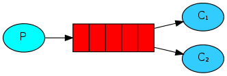

# Présentation des différentes possibilitées de RabbitMQ

Pour récupérer le jar rien de plus simple aller dans le menu action du répertoire et cliquer sur la dernière action en succès et télécharger l'artifact

## Installation rapide de rabbitMq
Utilisation d'un container docker, ici rabbitMq n'est pas sécurisé par un login password mais bon pour des exemple ceci n'est pas nécéssaire.
```sh
docker run -d --hostname my-rabbit --name some-rabbit -p 5672:5672 rabbitmq:3-management
```

### Pour supprimer le container et l'image
```sh
docker rm some-rabbit
docker rmi rabbitmq:3-management
```

## 01 Hello world
  
Ici nous avons le Producer (P) qui insère un message dans la queues qui est ensuite récupérer par le Consumer (C)

Ceci peut être patique quand nous attendons pas de retour du consumer et par exemple si le consumer est occupé ou indisponible le message reste dans la queue et sera lue quand le consumer pourra le lire.

```sh
# A exécuter dans un premier terminal
java -jar ./target/rabbitmq-1.0.jar --spring.profiles.active=hello-world,receiver

# A exécuter dans un second terminal
java -jar ./target/rabbitmq-1.0.jar --spring.profiles.active=hello-world,sender
```

## 02 Work Queues
  
Ici nous avons la même chose que le premier mais nous allons montrer l'efficacité de RabbitMq.
Si le C1 est occupé mais le C2 ne l'est pas le C2 traitera les messages jusqu'à temps que C1 puisse reprendre le traitement des messages.  
Un cas simple pour exemple si un consumer peut lire un message toutes les 10 secondes dû au traitement de celui-ci avec les 2 consumers nous pourrons en lire 2 en 10 secondes .
```sh
# A exécuter dans un premier terminal
java -jar ./target/rabbitmq-1.0.jar --spring.profiles.active=work-queues,receiver

# A exécuter dans deux autres terminaux
java -jar ./target/rabbitmq-1.0.jar --spring.profiles.active=work-queues,sender
```

## 03 Publish/Subscribe
  
Par rapport aux deux premiers exemples nous avons un exchange (X). Sur cet exchange nous avons deux queues qui se sont abonnées à celui-ci. Alors quand le producer va envoyer un message celui-ci sera transféré à l'exchange qui va l'insérer dans les deux queues et ainsi ce message sera lu par les deux consumers.
```sh
# A exécuter dans un premier terminal
java -jar ./target/rabbitmq-1.0.jar --spring.profiles.active=publish-subscribe,receiver

# A exécuter dans un second terminal
java -jar ./target/rabbitmq-1.0.jar --spring.profiles.active=publish-subscribe,sender
```

## 04 Routing
  
Ici même principe que l'exemple 3 sauf qu'ici nous ajoutons un clé de routing. Donc si le producer envoi "orange" celui-ci sera lu uniquement par C1 et si le message est "back" ou "green" il sera lu uniquement par C2.
```sh
# A exécuter dans un premier terminal
java -jar ./target/rabbitmq-1.0.jar --spring.profiles.active=routing,receiver

# A exécuter dans un second terminal
java -jar ./target/rabbitmq-1.0.jar --spring.profiles.active=routing,sender
```

## 05 Topics
  
Ici même principe que l'exemple 4 sauf qu'il est plus permisif.
Dans l'image nous voyons :  
- *.orange.* => ceci veut dire qu'il redirige les messages vers C1 quand orange à un mot devant et un mot derrière, comme toto.orange.titi
- *.*.rabbit => ceci veut dire qu'il redirige les messages vers C2 quand rabbit à deux mots devant , comme toto.titi.rabbit
- lazy.# => ceci veut dire qu'il redirige les messages vers C2 quand lazy à zéro ou plusieurs mots derrière , comme lazy ou lazy.toto ou lazy.toto.titi
```sh
# A exécuter dans un premier terminal
java -jar ./target/rabbitmq-1.0.jar --spring.profiles.active=topics,receiver

# A exécuter dans un second terminal
java -jar ./target/rabbitmq-1.0.jar --spring.profiles.active=topics,sender
```

## 06 RPC
  
Ici nous avons le consumer (C) et le serveur (S), le consumer envoi un message au serveur est attend une réponse de celui-ci.
Exemple le consumer peut envoyer un chiffre et le serveur lui renvoit le résultat de la suite de fibonacci à cette occurence.
```sh
# A exécuter dans un premier terminal
java -jar ./target/rabbitmq-1.0.jar --spring.profiles.active=rpc,server

# A exécuter dans un second terminal
java -jar ./target/rabbitmq-1.0.jar --spring.profiles.active=rpc,client
```